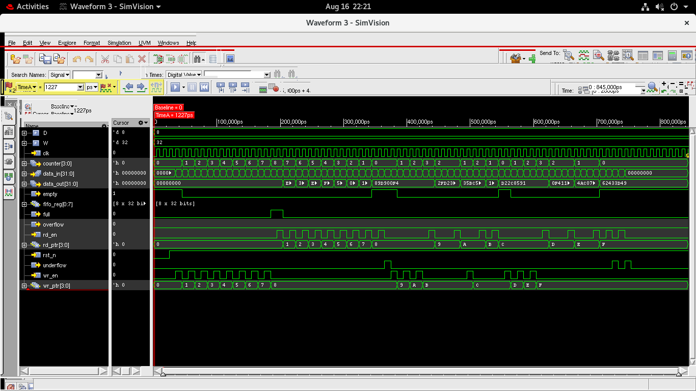
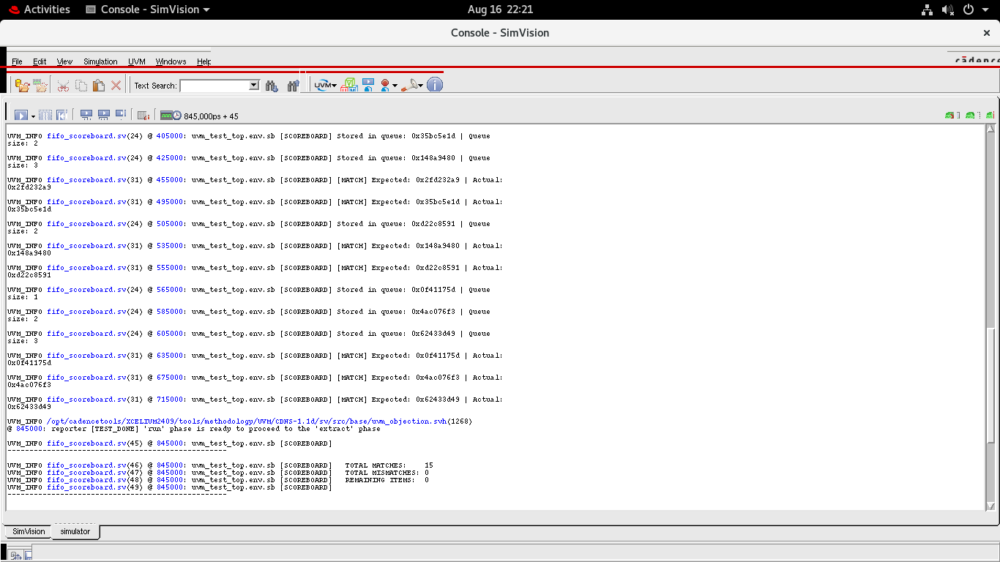

# SystemVerilog FIFO with UVM Testbench

This repository contains a parameterized synchronous FIFO (First-In-First-Out) written in SystemVerilog, accompanied by a complete Universal Verification Methodology (UVM) testbench.

## Project Overview

The project implements a standard synchronous FIFO memory structure commonly used in digital logic design for buffering and data flow control between different clock domains (if adapted to async) or processes. This implementation is synchronous, meaning all operations are coordinated by a single clock.

To assure the robustness and correctness of the FIFO, a UVM-based testbench is provided. UVM is the industry-standard methodology for verifying complex digital designs. The testbench generates constrained random stimuli, drives them into the FIFO, and uses a scoreboard to compare the expected outputs against the actual outputs from the design under test (DUT).

## Design Details (`fifo.sv`)

The core design is a synchronous FIFO module, parameterized for flexibility:

### Parameters
* **`W` (Width):** Data width in bits (Default: 32)
* **`D` (Depth):** Number of entries the FIFO can hold (Default: 8)

### Ports
| Port Name   | Direction | Width | Description |
| :---        | :---      | :---  | :---        |
| `clk`       | Input     | 1     | Clock signal. All operations are synchronized to the positive edge. |
| `rst_n`     | Input     | 1     | Active-low asynchronous reset. Clears the FIFO and resets pointers. |
| `data_in`   | Input     | W     | Data to be written into the FIFO. |
| `wr_en`     | Input     | 1     | Write enable signal. When high, `data_in` is written if the FIFO is not full. |
| `rd_en`     | Input     | 1     | Read enable signal. When high, data is read out if the FIFO is not empty. |
| `data_out`  | Output    | W     | Data read from the FIFO. |
| `full`      | Output    | 1     | High when the FIFO is full. Further writes will cause an overflow. |
| `empty`     | Output    | 1     | High when the FIFO is empty. Further reads will cause an underflow. |
| `overflow`  | Output    | 1     | High when a write is attempted while the FIFO is full. |
| `underflow` | Output    | 1     | High when a read is attempted while the FIFO is empty. |
| `counter`   | Output    | $clog2(D)+1 | Number of items currently stored in the FIFO. |

### Features
* Simultaneous read and write support.
* Full and empty status flags based on internal read and write pointers.
* Overflow and underflow protection/reporting.

## UVM Testbench Architecture

The verification environment is built using the UVM standard and is composed of the following key components:

* **`fifo_if`:** The SystemVerilog interface that bundles the signals connecting the DUT and the testbench.
* **`fifo_item`:** The UVM sequence item (transaction) representing a single operation (read, write, or both) along with the data. It includes constraints for randomized generation.
* **`fifo_sequence`:** Defines the patterns of stimuli. The current implementation features three phases:
  1. Filling the FIFO completely.
  2. Emptying the FIFO completely.
  3. Generating a sequence of randomized mixed read/write traffic.
* **`fifo_sequencer`:** The component that controls the flow of `fifo_item`s from the sequence to the driver.
* **`fifo_driver`:** Receives transactions from the sequencer and drives the corresponding signals onto the `fifo_if` according to the FIFO protocol.
* **`fifo_monitor`:** Passively observes the `fifo_if`, captures activity (reads and writes), and broadcasts them as transactions to the rest of the environment (e.g., scoreboard).
* **`fifo_scoreboard`:** The checker component. It receives the driven transactions and the observed outputs, predicts the expected behavior, and compares it against the actual DUT output to flag any errors.
* **`fifo_agent`:** Encapsulates the sequencer, driver, and monitor into a single reusable block.
* **`fifo_environment`:** The top-level UVM container that instantiates the agent and scoreboard, connecting them together.
* **`fifo_test`:** The top-level test class that instantiates the environment and starts the test sequence.
* **`fifo_top.sv`:** The top-level SystemVerilog module that instantiates the DUT, the interface, sets up the clock and reset, and calls `run_test()`.
* **`fifo_pkg.sv`:** A SystemVerilog package that includes and compiles all the UVM components in the correct order.

## Waveform and Logs




## How to Run

This testbench is currently configured to run using Cadence Xcelium (`xrun`).

To compile and run the simulation, execute the following command in the terminal from the root directory of the repository:

```bash
xrun -uvm fifo_if.sv fifo.sv fifo_pkg.sv fifo_top.sv
```

This command invokes Xcelium, enables UVM support, and compiles the necessary source files. The output of the test, including UVM info messages, pass/fail status, and coverage (if enabled), will be printed to the terminal and logged in `xrun.log`.

## Directory Structure

```
.
├── fifo.sv                 # The RTL design of the synchronous FIFO
├── fifo_agent.sv           # UVM Agent component
├── fifo_driver.sv          # UVM Driver component
├── fifo_environment.sv     # UVM Environment component
├── fifo_if.sv              # SystemVerilog Interface
├── fifo_item.sv            # UVM Sequence Item (Transaction)
├── fifo_monitor.sv         # UVM Monitor component
├── fifo_pkg.sv             # Package file to include all UVM components
├── fifo_scoreboard.sv      # UVM Scoreboard for verification
├── fifo_sequence.sv        # UVM Sequence definitions
├── fifo_sequencer.sv       # UVM Sequencer component
├── fifo_test.sv            # Top-level UVM test
└── fifo_top.sv             # Top-level TB module instantiating DUT and running test
```
